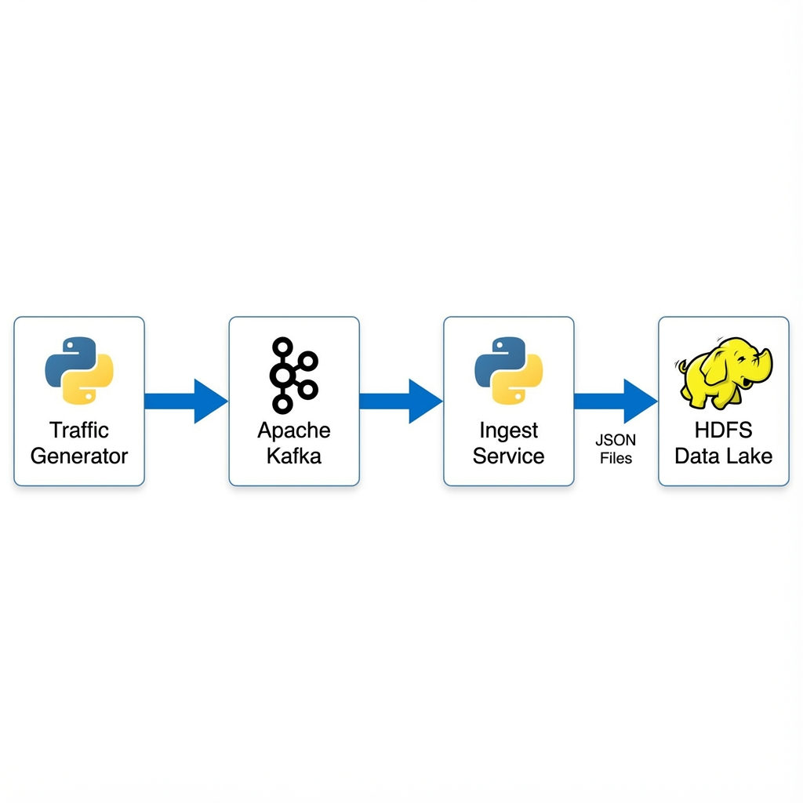
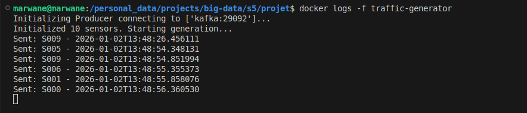
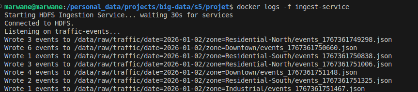

# Project Architecture:


The following diagram illustrates the "End-to-End" Big Data pipeline currently implemented up to Step 3 (HDFS Storage).

# Architecture Review

Component Details

1.  Traffic Generator (traffic-generator)
    Role: Simulates IoT sensors from a Smart City.
    Behavior: continuously generates random but realistic traffic events (vehicle count, speed, occupancy).
    Output: JSON messages sent to Kafka.

2.  Kafka Cluster (kafka, zookeeper)
    Role: Message broker buffer.
    Topic: traffic-events (3 partitions).
    Function: Decouples the high-speed generator from the storage layer.

3.  Ingest Service (ingest-service)
    Role: Bridge between Streaming and Batch storage.
    Behavior: Consumes messages from Kafka, buffers them (batch size: 10), and writes files to HDFS.
    Format: JSON files stored in /data/raw/traffic/date=YYYY-MM-DD/zone=ZONE/.

4.  HDFS (namenode, datanode1)
    Role: Distributed Data Lake (Raw Zone).
    Structure: Hierarchical directory structure partitioned by Date and Zone.

## Raw Data Format (JSON)

Each event stored in `/data/raw/traffic` follows this structure:

```json
{
  "sensor_id": "S001",
  "road_id": "R005",
  "road_type": "Highway",
  "zone": "Industrial",
  "vehicle_count": 45,
  "average_speed": 82,
  "occupancy_rate": 35.5,
  "event_time": "2026-01-02T14:30:00.000000"
}
```

## Integration with Part 4 (Data Processing)

The work achieved so far (Steps 1-3) provides the foundational **Raw Data Layer** of the Data Lake.
Part 4 (Spark Processing) will build upon this by:

1.  **Reading**: Accessing the raw JSON files accumulated in HDFS (`/data/raw/traffic`).
2.  **Processing**: Using Apache Spark to perform batch aggregations (e.g., calculating average traffic per zone) that serve as business indicators.
3.  **Transformation**: Converting this raw, voluminous data into optimized insights (Parquet format) ready for analysis.

traffic-generator:



ingest service:


access hdfs:

exemple
docker exec namenode hdfs dfs -cat /data/raw/traffic/date=2026-01-02/zone=Residential-North/events_1767361749298.json

```json
{
  "sensor_id": "S009",
  "road_id": "R002",
  "road_type": "Highway",
  "zone": "Residential-North",
  "vehicle_count": 47,
  "average_speed": 76,
  "occupancy_rate": 47.34,
  "event_time": "2026-01-02T13:48:26.456111"
},
{
  "sensor_id": "S009",
  "road_id": "R002",
  "road_type": "Highway",
  "zone": "Residential-North",
  "vehicle_count": 51,
  "average_speed": 73,
  "occupancy_rate": 51.74,
  "event_time": "2026-01-02T13:48:54.851994"
}
```

type of generated traffic events:

```python
ZONES = ["Downtown", "Industrial", "Residential-North", "Residential-South", "Suburbs"]

ROAD_TYPES = ["Highway", "Avenue", "Street"]
```
